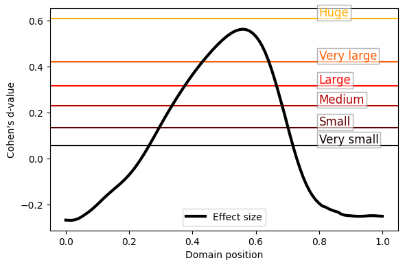

# esrot1d

### Effect size rules of thumb for one-dimensional functional data

 
 

This is a project repository associated with the following paper:

Pataky TC, Pini A, Preatoni E, Schelin L (2026) Effect size rules of thumb for one-dimensional functional data with an application to gait analysis. *Statistics in Medicine*, in review.

 
 

 
 

⚠️  The attached **esrot1d** code is NOT on a managed Python package index like PyPI because this code is not comprehensive, and is instead meant primarily to reproduce the results of the paper above. In particular, only simple one-sample and two-sample designs are currently supported; **effect size interpretations are NOT supported for arbitrary data scenarios**.  A more comprehensive package --- supporting other effect sizes and other experiment designs --- may emerge in the future but may be housed in a separate repository.

 
 

### Documentation

- [Installation](doc/install.md)
- [Examples](doc/examples.ipynb)
- [Repository overview](doc/overview.md)
- [**esrot1d** package overview](doc/esrot1d.md)
- [Reproduce all paper figures](doc/all_figures.ipynb)
- [Sample size and smoothness effects](doc/n_fwhm.ipynb)

